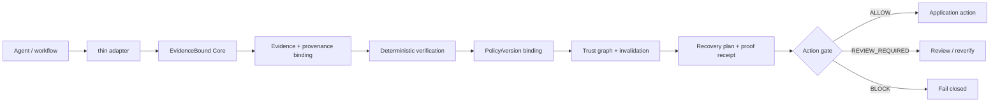

# EvidenceBound Core

[](https://github.com/evidencebound/evidencebound-core/actions/workflows/ci.yml)
[](https://github.com/evidencebound/evidencebound-core/releases/tag/v0.3.0)
[](https://www.python.org/)
[](LICENSE)

**EvidenceBound is a framework-agnostic, LLM-independent runtime for binding agent outputs to evidence, provenance and policy; verifying protected state; computing dependency blast radius; and planning fail-closed selective recovery.**

Created and maintained by Ruslan Vrublevskyi.

> Status: **GitHub source release `v0.3.0` published 2026-08-17** from exact commit `2477164acfbdca6a843bf7b2eac5fa21ce9901b2`. The tagged source passed the full Python 3.10–3.13, clean-room, typing/build, benchmark and security CI gates before publication. Current `main` contains additional **Unreleased** hardening, including provider-neutral signed receipts, durable persistence/restart support, and a real Google ADK 2.7.0 lifecycle compatibility lane. PyPI is **not published**. Pre-1.0 API compatibility is not guaranteed.

## Why EvidenceBound?

Agent memory answers “what did the system remember?” EvidenceBound adds “what evidence supported it, which policy governed it, is the historical record intact, is it still applicable, and what must be recomputed if a dependency changes?”

It is **not** a vector database, RAG framework, tracing backend, LLM framework, truth oracle, or consensus system. A cryptographic digest or signature can bind/authenticate bytes under configured trust roots; neither can make a malicious upstream source truthful. A durable database row is likewise not automatically trusted state.



## Install

From a checkout:

```bash
python -m pip install .
```

No unconditional runtime dependency is required beyond Python 3.10+. The SQLite reference persistence provider uses Python's stdlib `sqlite3` and therefore adds no third-party dependency.

Optional Ed25519 signed-receipt reference provider:

```bash
python -m pip install '.[crypto]'
```

## 5-minute quickstart

```python
from evidencebound import (
    EvidenceBound, EvidenceRecord, InvalidationReason,
    PolicyBinding, ProvenanceRecord,
)

policy = PolicyBinding("research-policy", "1")
eb = EvidenceBound(policy=policy)

evidence = [EvidenceRecord(
    evidence_id="paper-1",
    payload={"claim": "observed"},
    provenance=ProvenanceRecord("paper", "doi:10.0000/example"),
)]

research = eb.checkpoint(
    agent="researcher",
    evidence=evidence,
    output={"summary": "supported"},
)

decision = eb.verify(research)
print(decision.action)         # ALLOW for this complete/current snapshot
print(decision.receipt)        # tamper-evident binding receipt

plan = eb.invalidate(
    checkpoint_id=research.checkpoint_id,
    reason=InvalidationReason.EVIDENCE_CHANGED,
)
print(plan.reusable)
print(plan.requires_verification)
print(plan.recompute)
```

Run the complete external acceptance scenario:

```bash
python examples/golden_acceptance.py
```

It proves the intended sequence: checkpoint → receipt → tamper detection → historical integrity retained while applicability requires review → exact invalidation → consequential action blocked until successful path-specific re-verification.

## Trust semantics

Evidence state and record integrity are separate dimensions.

- `UNCHANGED`: current evidence identity and digest match the protected snapshot.
- `NEW`: a supplied current evidence ID was absent from the protected snapshot.
- `CHANGED`: the digest differs. **This does not mean REFUTED.**
- `STALE`: validity horizon has elapsed when an explicit current time is supplied.
- `MISSING`: required current evidence is absent or its supplied identity does not match the protected record.
- `REFUTED`: an upstream verifier explicitly marks evidence refuted.

Current evidence mapping keys must match the contained `EvidenceRecord.evidence_id`; an identity mismatch fails closed rather than being accepted because payload bytes happen to match.

Possible outcomes:

- historical integrity `VERIFIED` + current applicability `VERIFIED` → `ALLOW`;
- historical integrity `VERIFIED` + changed/stale/new/policy-drift applicability → `REVIEW_REQUIRED`;
- integrity failure, missing/refuted evidence, identity mismatch, or required provenance loss → `BLOCK`.

## What a receipt proves

The base `ProofReceipt` binds a checkpoint to a deterministic SHA-256 digest under the versioned `EBCJ-1` canonicalization domain. `verify_receipt()` validates receipt metadata and checkpoint binding; `verify_verification_receipt()` additionally binds the supplied historical verification result. Unsigned receipts remain tamper-evident **when retained or anchored independently of mutable checkpoint state**, but they do not authenticate an issuer.

Current `main` also exposes provider-neutral `ReceiptSigner` / `ReceiptVerifier` contracts plus `SignedProofReceipt`, `sign_receipt()` and `verify_signed_receipt()`. The optional Ed25519 provider lives under `evidencebound.providers.ed25519` and is not imported by core. ACTIVE keys may create new signatures; RETIRED keys may verify historical receipts; REVOKED/UNKNOWN keys and unsupported algorithms fail closed. Legacy unsigned receipts remain explicitly `UNSIGNED` and are never silently upgraded.

A valid signature authenticates the signed receipt under the application's configured key identity/trust roots. It does **not** prove upstream truth, provenance honesty, secure key custody, secure time, or legal compliance. See [`docs/SIGNED_RECEIPTS.md`](docs/SIGNED_RECEIPTS.md).

## Durable persistence and restart

Current `main` defines a provider-neutral `PersistenceStore` contract and a stdlib reference implementation at `evidencebound.providers.sqlite.SQLiteStore`.

```python
from evidencebound.providers.sqlite import SQLiteStore

with SQLiteStore("agent-state.sqlite3") as store:
    store.commit_bundle(checkpoint, verification_result)

# New process / later restart
with SQLiteStore("agent-state.sqlite3") as store:
    graph, verification_by_id = store.load_recovery_state()
```

Checkpoint, receipt, verification state and an optional replay record are committed as one transaction. A pre-commit interruption rolls the bundle back. On reopen, persisted verification is **not trusted because it was stored**: EvidenceBound reconstructs the checkpoint/receipt/result and re-runs deterministic result binding before the state can feed recovery as reusable.

`SQLiteReplayGuard` preserves equal-payload duplicate detection and conflicting-payload rejection across restart. It remains an idempotency primitive, not an exactly-once guarantee. Unknown/incomplete persistence schemas fail closed; the alpha provider does not silently migrate trust-bearing history.

SQLite is not claimed immutable or authenticated. For attackers able to rewrite both checkpoint and receipt state consistently, use an independent receipt anchor and/or signed receipts with independently protected verification roots as appropriate to the threat model. See [`docs/PERSISTENCE.md`](docs/PERSISTENCE.md).

## Canonicalization

`EBCJ-1` accepts null, booleans, integers, Unicode strings, lists, and string-keyed maps. Maps are sorted, JSON is compact UTF-8, and floats are rejected to avoid cross-runtime ambiguity. This is an EvidenceBound format, **not a claim of RFC 8785 compliance**. See [`SPEC.md`](SPEC.md).

## Recovery

`DependencyGraph` validates IDs/dependencies, rejects cycles, provides deterministic topological ordering, and computes exact descendants.

`plan_recovery()` distinguishes:

- `recompute`: checkpoints in the exact invalidation blast radius;
- `reusable`: unaffected checkpoints with an `ALLOW` verification result cryptographically bound to the exact checkpoint currently in the graph;
- `requires_verification`: unaffected state that cannot yet be trusted for reuse;
- `blocked`: consequential actions that may not proceed.

Re-verification requirements are dependency-path-specific, so an unrelated invalidation does not contaminate an independent branch. `ReplayGuard` provides in-process idempotent duplicate detection; `SQLiteReplayGuard` can persist those semantics across restart. Neither claims exactly-once execution.

## Adapters

Core never imports an agent framework. Included integration seams:

- `evidencebound.adapters.run_guarded` — plain Python callable hook.
- `evidencebound.adapters.google_adk.AdkCallbackAdapter` — dependency-free Google ADK seam. Current Unreleased `main` also includes `adk_consequential_action_allowed()`, a fail-closed application gate that requires explicit serialized EvidenceBound `ALLOW` callback state.

The maintained compatibility CI currently installs **exactly `google-adk==2.7.0` on Python 3.13** in an isolated job after installing EvidenceBound without integration dependencies. A credential-free synthetic real ADK `BaseAgent`/`Runner` scenario proves runtime `callback_context` keyword invocation, persisted callback state on completed lifecycle, emitted state delta, and blocked consequential state when the async event stream is closed before `after_agent_callback`. This is evidence for the exact tested ADK version, not a blanket compatibility claim for other releases.

See [`docs/INTEGRATION.md`](docs/INTEGRATION.md).

## Verify this checkout

```bash
python -m pip install -e '.[dev]'
pytest
python examples/golden_acceptance.py
python benchmarks/selective_recovery.py
python -m compileall -q src examples benchmarks compat
ruff check .
mypy src/evidencebound
python -m build
```

CI additionally performs an isolated clean-room installation, runtime-dependency assertion, pip-audit, Bandit scan, wheel reinstall/import, the benchmark acceptance scenario, and the isolated exact-version Google ADK compatibility lane. See `.github/workflows/ci.yml` and [`RELEASE_READINESS.md`](RELEASE_READINESS.md).

## Security and non-goals

Read [`THREAT_MODEL.md`](THREAT_MODEL.md) before using EvidenceBound for consequential actions. The library helps detect unsupported/missing/stale/refuted evidence when that state is supplied or derivable; it cannot establish truthfulness of a malicious source, protect a compromised runtime, guarantee safe key custody/immutable storage, or guarantee legal/regulatory compliance.

## Project documents

- [`ARCHITECTURE.md`](ARCHITECTURE.md)
- [`SPEC.md`](SPEC.md)
- [`THREAT_MODEL.md`](THREAT_MODEL.md)
- [`SECURITY.md`](SECURITY.md)
- [`CONTRIBUTING.md`](CONTRIBUTING.md)
- [`ROADMAP.md`](ROADMAP.md)
- [`docs/SIGNED_RECEIPTS.md`](docs/SIGNED_RECEIPTS.md)
- [`docs/PERSISTENCE.md`](docs/PERSISTENCE.md)
- [`docs/INTEGRATION.md`](docs/INTEGRATION.md)
- [`RELEASE_READINESS.md`](RELEASE_READINESS.md)
- [`FUNDING_READINESS.md`](FUNDING_READINESS.md)
- [`PREEXISTING_WORK.md`](PREEXISTING_WORK.md)
- [`LICENSE_DECISION.md`](LICENSE_DECISION.md)

## License

Apache-2.0. See [`LICENSE_DECISION.md`](LICENSE_DECISION.md) for the project-specific rationale and provenance boundary.
