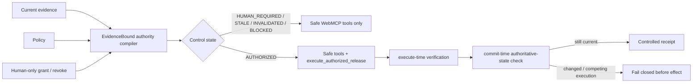

# EvidenceBound WebMCP Authority Compiler — Competition Evidence Pack

Competition: OpenAI WebMCP Challenge 2026
Status: production-deployed engineering evidence pack, 2026-08-31
Pre-competition baseline: `9a2137fe29d0532120a774398a45fa90a9850153`
Final competition implementation head: `14f7a81200daafa717af474c0747ac4e215b195d`
Production merge SHA: `1655514e60e8266331cb431c7726f37725608c99`
Canonical judge URL: `https://evidencebound.org/webmcp/`
License: Apache-2.0

## Thesis

**WebMCP exposes browser capability; EvidenceBound compiles current evidence, policy and human authority into which capability is valid now, then re-checks that authority at execution time and immediately before receipt commit.**

Judge shorthand:

> **Capability follows current authority.**

This competition-period contribution does **not** claim to invent approval, provenance, revocation, invalidation, proof receipts, dependency graphs, MCP, or dynamic tool registration. The contribution is their browser-native authority projection: correction/revocation changes the model-visible WebMCP capability surface, while retained or racing execution attempts still fail closed before a success receipt can commit.

## Why WebMCP is load-bearing

Without WebMCP, the agent loses the structured browser capability plane whose lifecycle is controlled. Without the EvidenceBound gate, that capability plane does not encode current evidence and human authority.

## Five control states

| State | Meaning | Mutation tool |
|---|---|---|
| `AUTHORIZED` | Required evidence is current and the human grant matches its exact fingerprint. | Registered; execution re-checks authority. |
| `HUMAN_REQUIRED` | Evidence is usable but no current human grant exists. | Absent. |
| `STALE` | Required evidence exceeded its validity horizon. | Absent. |
| `INVALIDATED` | A prior grant was revoked or no longer matches current evidence. | Removed/absent. |
| `BLOCKED` | Required evidence/policy is not satisfied, or an execution loses the commit-time race against newer authoritative state. | Absent / execution refused. |

Fail-closed precedence in the authority evaluator: `BLOCKED > STALE > INVALIDATED > HUMAN_REQUIRED > AUTHORIZED`.

## Human authority boundary

The model-callable surface can:

- inspect current evidence/authority;
- record a request for human authority;
- list bounded controlled receipts;
- execute only when the exact current grant is valid.

The model-callable surface cannot grant, approve, revoke, correct, restore, or bypass human authority. Human-only visible UI controls own those transitions.

A replacement grant is rejected while state is `INVALIDATED`, `STALE`, or `BLOCKED`; explicit human recovery must return the system to `HUMAN_REQUIRED` before a new exact-snapshot grant can be issued.

## WebMCP tool surface

Always eligible:

- `inspect_release_control`
- `request_release_authority`
- `list_control_receipts`

Conditionally registered:

- `execute_authorized_release` — only while current state is `AUTHORIZED`.

The adapter uses `document.modelContext.registerTool(...)` with registration `AbortSignal`s. The public app feature-detects the real runtime and reports `WEBMCP_UNAVAILABLE` rather than simulating WebMCP.

## Race / stale-authority hardening

Formal review found two material execution gaps after the initial green implementation. Both were converted into adversarial RED tests before fixes.

### Correction during async verification

A callback could begin from an authorized object while a human correction replaced authoritative state during an async digest. The hardened callback checks that the authoritative state object is still the verified snapshot immediately before receipt commit; no await exists between that check and `onReceipt()`.

Evidence:

- RED commit: `3b135b2af0fc56beb56a3f91a2df226bad7f3401`
- expected failing WebMCP run: `33391975115`
- fix: `b5ccff91c76c51c2de4298798308b4b5464937f4`

### Concurrent execution

Two parallel calls could originate from the same authorized snapshot. The final contract allows at most one to commit a receipt; once the first receipt changes authoritative state, the second loses the commit check and returns typed `BLOCKED / BLOCKED_BEFORE_EFFECT` while preserving `authorityStatus=AUTHORIZED` when that distinction is relevant.

Evidence:

- RED commit: `610c2156d1a8305b5e0e40349b33885e1e40da53`
- expected failing WebMCP run: `33392402552`
- fix/final implementation head: `14f7a81200daafa717af474c0747ac4e215b195d`

These tests support the implemented adapter contract; they are not a claim of formal verification or universal race freedom outside that contract.

## Production acceptance

At production merge SHA `1655514e60e8266331cb431c7726f37725608c99`:

- post-merge WebMCP workflow: **PASS** — run `33393610245`;
- post-merge full Core CI: **PASS** — run `33393610270`, including security, clean-room, supply-chain and trusted supply-chain attestation jobs;
- exact-SHA Vercel deployment: **READY / production** — `dpl_GFsK47tx8z4P5F1G42rrgSJuin5N`;
- canonical `https://evidencebound.org/webmcp/`: **HTTP 200**;
- `app.mjs`, `webmcp-adapter.mjs`, `control-core.mjs`: **HTTP 200**;
- observed CSP restricts scripts/network to self and blocks framing; HSTS, `nosniff`, frame deny and restrictive Permissions-Policy are present;
- real supported-browser WebMCP discovery/invocation/removal: **UNRUN in this Project environment**.

See [`PRODUCTION_ACCEPTANCE.md`](PRODUCTION_ACCEPTANCE.md) for the exact evidence/claim boundary.

## Competition-period implementation map

| Path | Responsibility |
|---|---|
| `site/webmcp/control-core.mjs` | Evidence fingerprint, five-state evaluation, human grant/revoke/recovery, bounded controlled receipts. |
| `site/webmcp/webmcp-adapter.mjs` | Dynamic WebMCP lifecycle, execute-time verification, stale-state and concurrency commit gate. |
| `site/webmcp/app.mjs` | Real runtime feature detection, human-only transitions, compiler/browser tool lists, visible receipts/events. |
| `site/webmcp/index.html` | Credential-free judge surface and explicit controlled-demo/claim boundary. |
| `site/webmcp/styles.css` | Responsive judge UI. |
| `site/webmcp/control-core.test.mjs` | Authority/state/recovery/receipt contract. |
| `site/webmcp/webmcp-adapter.test.mjs` | Lifecycle, stale descriptor, correction-during-verification and concurrent-execution adversarial gates. |
| `tests/test_webmcp_site.py` | Static public-surface, CSP, no-network and no-secret contract. |
| `.github/workflows/webmcp.yml` | Pinned Node syntax + WebMCP tests. |
| `site/vercel.json` | Self-hosted module CSP and security headers. |

## TDD / provenance boundary

Meaningful RED commits remain in Git history rather than being squashed away. The merge commit has the pre-competition main baseline and final WebMCP branch head as parents, preserving the challenge-period boundary.

Pre-existing work is explicitly disclosed in [`../2026-preexisting-work-ledger.md`](../2026-preexisting-work-ledger.md) and the root [`../../../PREEXISTING_WORK.md`](../../../PREEXISTING_WORK.md). Do not present pre-existing EvidenceBound provenance, recovery, persistence, signed-receipt, authority-cut or verified-memory primitives as WebMCP-period inventions.

## Security / claim boundaries

- no model-callable human authority mutation;
- no external script/CDN dependency;
- no challenge credential, token or environment-secret dependency;
- no external network call in the canonical judge JS;
- controlled receipt explicitly reports `externalSideEffect=false`;
- receipt is tab-local and is not claimed as independently durable/anchored;
- public production deployment is real, but the controlled `execute_authorized_release` effect is not a real production release;
- no claim of first/only/unique invention, security certification, guaranteed safety, customers or traction without separate evidence.

## Judge materials

- [`JUDGE_PATH.md`](JUDGE_PATH.md) — exact 60–90 second behavioral proof.
- [`VIDEO_SCRIPT.md`](VIDEO_SCRIPT.md) — claim-safe <3 minute submission script.
- [`PRODUCTION_ACCEPTANCE.md`](PRODUCTION_ACCEPTANCE.md) — post-merge CI/deployment/HTTP evidence.
- [`CLAIMS_LEDGER.md`](CLAIMS_LEDGER.md) — allowed/prohibited wording.
- [`../2026-preexisting-work-ledger.md`](../2026-preexisting-work-ledger.md) — conservative prior-work disclosure.
- [`../../superpowers/specs/2026-08-31-webmcp-authority-compiler-design.md`](../../superpowers/specs/2026-08-31-webmcp-authority-compiler-design.md) — architecture tournament and design freeze.

## Winner-gap status

| Criterion | Current strength | Remaining controllable gap |
|---|---|---|
| WebMCP Leverage | Current authority directly controls model-visible tool lifecycle; execution independently re-checks state. | Run and capture the exact path in a supported WebMCP browser. |
| Execution | Post-merge CI, adversarial tests, production deployment and canonical HTTP/security acceptance PASS. | Browser-native rehearsal/video only. |
| Potential Impact | Reusable pattern for consequential browser workflows where authorization can become stale or revoked. | Keep generalization concrete and avoid unsupported market claims. |
| Creativity & Ambition | Treats browser capability as a revocable projection of evidence + authority rather than a static action catalog. | Make this distinction unmistakable in the first 15 seconds of the video. |

Engineering production acceptance is **PASS** for the gates available in this Project environment. Competition/browser acceptance remains **UNRUN** until a supported WebMCP browser completes [`JUDGE_PATH.md`](JUDGE_PATH.md). Submission remains **ACTIVE**, not complete.
