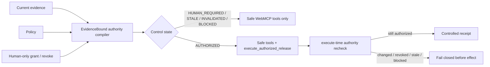

# EvidenceBound WebMCP Authority Compiler — Competition Evidence Pack

Competition: OpenAI WebMCP Challenge 2026
Status of this document: branch evidence pack, 2026-08-31
Competition branch: `feat/webmcp-authority-compiler-2026`
Pre-competition baseline parent: `9a2137fe29d0532120a774398a45fa90a9850153`
Current critical implementation head: `1adda44a35d4b96c937e4fa5dd4f7ac7c7cd5e7b`
License: Apache-2.0

## Thesis

**WebMCP exposes browser capability; EvidenceBound compiles current evidence, policy and human authority into which capability is valid now, then re-checks that authority at execution time.**

The judge-facing shorthand is:

> **Capability follows current authority.**

The WebMCP-period contribution is deliberately narrower than EvidenceBound Core's prior work. It does **not** claim to invent approval, provenance, revocation, invalidation, proof receipts, dependency graphs, MCP, or dynamic tool registration. It combines those control requirements into a browser-native WebMCP authority projection whose model-visible mutation capability changes when evidence/authority changes, while a retained stale tool callback still fails closed at execution.

## Why WebMCP is load-bearing

The controlled judge workflow is not a chat wrapper around a normal button. WebMCP is the agent's structured browser capability plane:

Removing WebMCP materially degrades the core judge behavior: the agent no longer receives the structured tool surface whose lifecycle is being compiled from authority state. Removing the EvidenceBound gate materially degrades it in the opposite direction: the mutation tool no longer encodes current evidence/authority validity.

## Five control states

| State | Meaning | Mutation tool |
|---|---|---|
| `AUTHORIZED` | Required evidence is current and the human grant matches its exact fingerprint. | Registered, with execute-time recheck. |
| `HUMAN_REQUIRED` | Evidence is usable but no current human grant exists. | Absent. |
| `STALE` | Required evidence exceeded its validity horizon. | Absent. |
| `INVALIDATED` | A prior grant was revoked or no longer matches current evidence. | Removed/absent. |
| `BLOCKED` | Required evidence/policy is not satisfied. | Absent. |

Fail-closed precedence: `BLOCKED > STALE > INVALIDATED > HUMAN_REQUIRED > AUTHORIZED`.

## Human boundary

The agent can inspect state and record an authority request. It cannot grant, approve, revoke, correct, restore, or bypass authority through WebMCP.

Human-only visible UI controls own those transitions. The pure authority core now also rejects replacement grants directly from `INVALIDATED`, `STALE`, or `BLOCKED`; explicit recovery must return the system to `HUMAN_REQUIRED` before a new grant can be issued.

## WebMCP tool surface

Always eligible for registration:

- `inspect_release_control` — read-only current state, evidence summary, authority fingerprint and safe next action.
- `request_release_authority` — records a visible pending request only; creates no grant.
- `list_control_receipts` — reads bounded tab-local controlled receipts.

Conditionally registered:

- `execute_authorized_release` — exists only while `evaluateControl()` returns `AUTHORIZED`; before the controlled effect it re-runs `evaluateControl()` on live state. A callback retained from an earlier discovery therefore cannot bypass a later correction/revocation.

Implementation uses the WebMCP imperative API through `document.modelContext.registerTool(...)` and registration `AbortSignal`s. The page feature-detects the real runtime and reports `WEBMCP_UNAVAILABLE` rather than simulating WebMCP.

## Critical implementation map

| Path | Responsibility | Competition-period evidence |
|---|---|---|
| `site/webmcp/control-core.mjs` | Deterministic evidence fingerprint, five-state evaluation, grant/revoke/recovery semantics, controlled receipt gate. | Added after baseline; hardened through `1adda44a35d4b96c937e4fa5dd4f7ac7c7cd5e7b`. |
| `site/webmcp/webmcp-adapter.mjs` | WebMCP registration lifecycle, safe tools, conditional execution tool, execute-time revalidation. | Added in `2283993be05589d6e1f9c30e5ea259fe6d191507`. |
| `site/webmcp/app.mjs` | Real browser feature detection, human-only transitions, live compiler/browser tool lists, visible event/receipt state. | Added in `dc5d10c872d1845291a4f6bb177b5be6c4bc2b9a`. |
| `site/webmcp/index.html` | Credential-free judge surface and explicit claim/demo boundaries. | Added in `265a5fd855f9f06d8a23f7e01f22b67bf08f8a4c`. |
| `site/webmcp/styles.css` | Responsive, accessibility-aware terminal surface. | Added in `45b1e135e13061264b1fdb5e96bfce261b42d530`. |
| `site/webmcp/control-core.test.mjs` | State/recovery/receipt contract tests. | TDD RED/GREEN history retained in branch. |
| `site/webmcp/webmcp-adapter.test.mjs` | Lifecycle, human-boundary, receipt and retained-stale-descriptor adversarial tests. | TDD RED/GREEN history retained in branch. |
| `tests/test_webmcp_site.py` | Static public-surface/CSP/no-network/no-secret contract. | Added in `ccc9375d5ff30490db8ff73a39c9d00b3d8120cd`; initial RED recorded before UI implementation. |
| `.github/workflows/webmcp.yml` | Pinned Node 22 syntax + unit/adversarial gate. | Added during competition period; browser modules explicitly syntax-checked. |
| `site/vercel.json` | Self-hosted script CSP while retaining same-origin/network/frame/base/form restrictions. | Changed in `5c79243086088d26ff64d9b5c4596c94d12d8330`. |

## TDD evidence retained in Git history

The branch intentionally preserves meaningful RED commits rather than presenting only a final green state:

1. Missing `control-core.mjs` → WebMCP workflow failed exactly on `ERR_MODULE_NOT_FOUND`.
2. Extended correction/revocation/receipt contract → failed on missing exports before implementation.
3. Missing `webmcp-adapter.mjs` → existing state tests passed while adapter suite failed exactly on `ERR_MODULE_NOT_FOUND`.
4. Missing judge UI/old CSP → existing Python tests passed while five new public-surface assertions failed.
5. Replacement-grant invariant → 19/20 WebMCP tests passed; the sole failure was the expected missing rejection for re-granting corrected `INVALIDATED` authority. `1adda44...` fixed the invariant.

This history is evidence of the implemented contract, not a claim that CI failures themselves improve judging.

## Current verified engineering status at critical implementation head

At `1adda44a35d4b96c937e4fa5dd4f7ac7c7cd5e7b`:

- WebMCP Node syntax gate: **PASS**.
- WebMCP unit/adversarial suite: **PASS**.
- Full EvidenceBound Core GitHub Actions CI: **PASS** (`33364696242`).
- Exact-commit Vercel preview build: **READY** (`dpl_CmNKp1zRBgcEjHPCVHddY9vjx1v9`).
- Preview HTTP readback from this Project Chat: **BLOCKED** by Vercel Deployment Protection / SSO; this does not count as public production acceptance.
- Real WebMCP discovery/invocation in a supported judge browser: **UNRUN** in this Project Chat until a WebMCP-capable browser environment is available.
- Canonical production `/webmcp/` acceptance: **UNRUN** until merge/deploy.

The final production document must only upgrade the last two statuses after observed evidence.

## Security and trust boundaries

- No agent-callable grant/revoke/correct/restore tool.
- No external network request in the canonical judge JS.
- No secret, token, cookie or environment dependency in the app.
- No external script/CDN dependency; CSP permits only self-hosted script execution.
- Mutation capability absence is defense in depth; execution independently revalidates live authority.
- Controlled receipts are tab-local identifiers and do not claim independent anchoring, authentication, immutability or a real external deployment.
- The release effect is intentionally controlled and has `externalSideEffect: false`.

## Prior work and rules

- Rules freeze: [`../2026-webmcp-sibyl-rules-freeze.md`](../2026-webmcp-sibyl-rules-freeze.md)
- Conservative prior-work ledger: [`../2026-preexisting-work-ledger.md`](../2026-preexisting-work-ledger.md)
- Architecture tournament/spec: [`../../superpowers/specs/2026-08-31-webmcp-authority-compiler-design.md`](../../superpowers/specs/2026-08-31-webmcp-authority-compiler-design.md)
- Execution plan: [`../../superpowers/plans/2026-08-31-webmcp-authority-compiler.md`](../../superpowers/plans/2026-08-31-webmcp-authority-compiler.md)
- Root pre-existing-work disclosure: [`../../../PREEXISTING_WORK.md`](../../../PREEXISTING_WORK.md)

## Judge materials

- [`CLAIMS_LEDGER.md`](CLAIMS_LEDGER.md)
- [`JUDGE_PATH.md`](JUDGE_PATH.md)
- [`VIDEO_SCRIPT.md`](VIDEO_SCRIPT.md)

## Current winner-gap assessment

| Criterion | Current evidence | Main remaining gap before technical READY |
|---|---|---|
| WebMCP Leverage | Tool discoverability itself follows authority state; stale callback revalidation is tested. | Observe real discovery/invocation/removal in a supported WebMCP browser after public deployment. |
| Execution | Dedicated Node gate + full Core CI + exact-commit preview READY. | Public production smoke/readback and visual judge-path rehearsal. |
| Potential Impact | Pattern generalizes to consequential browser workflows requiring revocable current authority. | Keep commercial/generalization claim grounded; no fabricated customers/traction. |
| Creativity & Ambition | Browser capability is treated as a revocable projection of evidence/authority rather than a static action catalog. | Make this distinction obvious in the first minute of the final demo. |

The project is **not technically READY** while the public production and real-browser WebMCP gates remain non-PASS.
